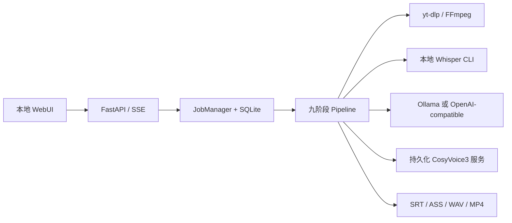

# 声译（AutoTranslate）

一个面向 macOS 本地运行的 AI 视频中文化 Web 应用。输入 YouTube 链接或本地视频后，它会依次完成视频导入、Whisper 转写、上下文翻译、中文字幕、CosyVoice3 声音克隆与逐句配音、时间轴对齐、背景音混合和 MP4 合成。

当前 MVP 重点支持“英文、单人讲话视频 → 简体中文字幕 + 中文 AI 配音”。任务、模型请求和媒体处理中间文件默认留在本机；选择 OpenAI-compatible 翻译服务时，待翻译文本会发送到你配置的接口。

> **声音授权提示**：只能克隆你本人的声音、已获得明确授权的声音，或你依法有权处理的素材。请勿用本项目冒充他人、误导受众或侵犯肖像权、声音权和版权。

## 处理流程与架构



主要目录：

```text
backend/
  api/                 HTTP、上传、SSE、任务控制和产物下载
  models/              Transcript、Segment、任务设置等领域模型
  pipeline/            下载、ASR、分段、翻译、TTS、对齐、混音、合成
  services/            SQLite JobStore 与后台 JobManager
  utils/               安全子进程、路径和原子文件辅助函数
frontend/              无构建步骤的本地 HTML/CSS/JavaScript WebUI
services/
  cosyvoice_server.py  模型只加载一次的独立 FastAPI TTS 服务
scripts/
  setup.sh             Python 环境与服务依赖安装
  start.sh             CosyVoice + WebUI 一键启动和退出清理
  check_environment.sh 本机工具、模型和服务检查
tests/                 不下载真实 YouTube 视频的单元测试
work/                  SQLite、任务缓存和最终产物（运行后生成）
```

后端通过参数数组调用外部程序，不使用 `shell=True`。每个任务拥有独立工作目录，任务元数据和日志保存在 SQLite，前端通过 SSE 接收进度。

## 当前本机验收状态

截至 2026-08-16，当前工作区已经完成以下实测：

- `.venv/bin/pytest -q`：`50 passed`。
- 一段 7.36 秒的本地英文 MP4 已实际跑完九个阶段：本地 Whisper 识别 2 段、Ollama（本次使用 `gemma4:26b`）翻译、CosyVoice3 零样本克隆逐段中文配音、时间轴修正、Fast 混音、soft subtitle 和 burn subtitle 合成。
- 完成任务实际生成了 `final_zh.mp4`、`final_zh_subtitle.mp4`、`final_zh_burned.mp4`、中英文字幕、转写/翻译 JSON、完整配音轨和混音轨。`ffprobe` 验证 `final_zh.mp4` 含 H.264 视频、AAC 音频和语言标记为 `zho` 的 `mov_text` 可选字幕轨；压制版含 H.264 视频和 AAC 音频，时长均为 7.36 秒。
- 本机 FFmpeg 不含 `ass`/libass filter，实测已自动走 Pillow + macOS CJK 字体生成透明字幕轨的回退路径，并成功得到压制字幕视频。
- `./scripts/start.sh` 已实测从 `cosyvoice` Conda 环境解析正确 Python、等待模型就绪并启动 WebUI；按 `Ctrl+C` 后，本次脚本启动的 WebUI 与 CosyVoice 子进程都会退出。

这次实测覆盖的是本地短视频完整链路。YouTube 网络下载、长视频和 Demucs 仍取决于网络、cookies、模型与本机资源，尚未被上述离线单元测试代替。

## macOS 前置条件

建议使用 Apple Silicon Mac、Python 3.10 或 3.11；代码最低要求 Python 3.9。开始前确认以下工具：

- Homebrew。
- FFmpeg 与 ffprobe，例如 `brew install ffmpeg`。
- 可直接调用的本地 Whisper CLI，例如 `whisper audio.mp3 --model turbo`。
- Conda，以及已经能够运行 CosyVoice3 的 `cosyvoice` 环境。
- `~/CosyVoice` 源码、`third_party/Matcha-TTS`，以及 CosyVoice3 模型目录。
- Ollama，或一个实现 `/chat/completions` 的 OpenAI-compatible 服务。
- YouTube 输入需要 `yt-dlp`；`setup.sh` 会将它安装到项目虚拟环境。
- Demucs 仅为 Advanced 模式的可选依赖。

可使用 Homebrew 安装系统媒体工具：

```bash
brew install ffmpeg
```

Whisper 和 CosyVoice 的安装方式会随你使用的 Python、PyTorch 与硬件后端不同。本项目不会替换已经可用的本地安装；只通过 `.env` 指向它们。

## 安装

在项目根目录运行：

```bash
./scripts/setup.sh
```

该脚本会：

1. 创建或复用 `.venv`。
2. 安装 `requirements.txt` 中的 FastAPI、yt-dlp 和测试依赖。
3. 在 `.env` 不存在时由 `.env.example` 创建它，不覆盖已有配置。
4. 如果检测到 `cosyvoice` Conda 环境，为独立 TTS 服务补齐 FastAPI、Uvicorn、Pydantic v2、SoundFile 等轻量服务依赖。
5. 运行环境检查。

如果暂时只做字幕、不希望修改或检查 CosyVoice 环境：

```bash
SKIP_COSYVOICE=1 ./scripts/setup.sh
```

也可以手动执行检查：

```bash
./scripts/check_environment.sh
```

`FAIL` 表示视频主流程需要但没有找到的工具；`WARN` 表示 YouTube、配音、Demucs 或当前模型服务等可选能力尚未就绪。

## 配置 `.env`

先按本机情况修改项目根目录的 `.env`。路径可以使用绝对路径或 `~`，不要把真实 API Key 提交到 Git；`.env` 已被 `.gitignore` 忽略。

```dotenv
WHISPER_BIN=whisper
WHISPER_MODEL=turbo

TRANSLATION_PROVIDER=ollama
OLLAMA_BASE_URL=http://127.0.0.1:11434
OLLAMA_MODEL=qwen2.5:14b

OPENAI_BASE_URL=
OPENAI_API_KEY=
OPENAI_MODEL=

COSYVOICE_ROOT=~/CosyVoice
COSYVOICE_MODEL=~/CosyVoice/pretrained_models/Fun-CosyVoice3-0.5B
COSYVOICE_URL=http://127.0.0.1:50001

FFMPEG_BIN=ffmpeg
FFPROBE_BIN=ffprobe
YTDLP_BIN=yt-dlp
YTDLP_PROXY=
YTDLP_COOKIES=

WORK_DIR=./work
ORIGINAL_AUDIO_VOLUME=0.14
MAX_UPLOAD_GB=20
HOST=127.0.0.1
PORT=8000
```

常用配置说明：

| 配置 | 作用 |
| --- | --- |
| `WHISPER_BIN` / `WHISPER_MODEL` | Whisper CLI 路径或命令名，以及默认模型 |
| `TRANSLATION_PROVIDER` | `ollama` 或 `openai` |
| `OLLAMA_BASE_URL` / `OLLAMA_MODEL` | Ollama 服务与模型，可在 WebUI 中按任务覆盖模型名 |
| `OPENAI_BASE_URL` | OpenAI-compatible API 根地址，通常包含 `/v1`；代码会补上 `/chat/completions` |
| `OPENAI_API_KEY` / `OPENAI_MODEL` | compatible 服务的凭据与模型；无需凭据的本地服务可把 Key 留空 |
| `COSYVOICE_ROOT` / `COSYVOICE_MODEL` | CosyVoice 源码和含 `cosyvoice3.yaml` 的模型目录 |
| `COSYVOICE_URL` | 后端访问持久化 TTS 服务的地址 |
| `YTDLP_PROXY` / `YTDLP_COOKIES` | yt-dlp 代理与 `cookies.txt` 路径，均可留空 |
| `WORK_DIR` | SQLite、分阶段缓存、日志与输出根目录 |
| `ORIGINAL_AUDIO_VOLUME` | Fast 模式中原音轨线性音量，默认 `0.14`，约为 -17 dB |
| `HOST` / `PORT` | WebUI 监听地址；默认仅限本机 |

启动脚本还接受这些可选环境变量：

| 变量 | 默认值 | 作用 |
| --- | --- | --- |
| `COSYVOICE_CONDA_ENV` | `cosyvoice` | CosyVoice Conda 环境名 |
| `CONDA_BIN` | `conda` | Conda 可执行文件路径或命令名 |
| `COSYVOICE_HOST` / `COSYVOICE_PORT` | `127.0.0.1` / `50001` | 自动启动的 TTS 服务监听地址；应与 `COSYVOICE_URL` 一致 |
| `COSYVOICE_START_TIMEOUT` | `300` | 等待模型加载完成的秒数 |
| `UVICORN_RELOAD` | `0` | 设为 `1` 时启用后端开发热重载 |
| `VENV_DIR` | `.venv` | `setup.sh` 创建的虚拟环境位置 |

## 翻译服务

### Ollama（默认）

先启动 Ollama 并准备模型：

```bash
ollama serve
ollama pull qwen2.5:14b
```

然后保持默认配置，或在 WebUI 中填写另一个已安装模型。翻译器会把连续字幕按批次提交，携带前后文，要求模型按原 segment ID 返回严格 JSON；无效 JSON 会校验并重试。

### OpenAI-compatible

在 `.env` 中填写自己的服务信息，以下仅为占位示例，不是真实凭据：

```dotenv
TRANSLATION_PROVIDER=openai
OPENAI_BASE_URL=https://your-provider.example/v1
OPENAI_API_KEY=replace-with-your-own-key
OPENAI_MODEL=your-model-name
```

如果 `OPENAI_BASE_URL` 已经以 `/chat/completions` 结尾，程序不会重复追加。选择远程提供方意味着字幕原文会离开本机，请自行核对服务条款和隐私要求。

## CosyVoice3 持久化服务

`./scripts/start.sh` 会先请求 `COSYVOICE_URL/health`：

- 已有且模型就绪：直接复用，不会在退出时停止它。
- 服务未运行：从 `cosyvoice` Conda 环境解析 Python 后台启动，只加载一次模型，并等待健康检查通过。
- 地址已有服务但模型加载失败：停止启动并显示明确提示，避免在同一端口重复拉起进程。
- 退出 WebUI 或按 `Ctrl+C`：只停止本次脚本自行启动的 CosyVoice 进程。

CosyVoice 日志位于 `WORK_DIR/logs/cosyvoice_server.log`。也可以在另一个终端手动启动：

```bash
conda run --no-capture-output -n cosyvoice \
  python services/cosyvoice_server.py
```

健康检查：

```bash
curl http://127.0.0.1:50001/health
```

`POST /synthesize` 接收 `text`、`prompt_audio`、`prompt_text` 和 `speed`，成功时直接返回 `audio/wav` 数据。服务会自动把参考文本规范为：

```text
You are a helpful assistant.<|endofprompt|>{参考录音对应原文}
```

出于安全考虑，`prompt_audio` 默认只能位于 `WORK_DIR` 内。确实需要其他目录时，可设置由冒号分隔的 `COSYVOICE_ALLOWED_AUDIO_ROOTS`；不要无必要地授权整个主目录。

如果只需要转写、翻译和字幕：

```bash
SKIP_COSYVOICE=1 ./scripts/start.sh
```

此时请在 WebUI 关闭“生成中文配音”。

## 启动与 WebUI

```bash
./scripts/start.sh
```

浏览器打开 [http://127.0.0.1:8000](http://127.0.0.1:8000)。页面支持：

- YouTube URL 或本地 MP4、MOV、MKV、WebM 等视频上传，二选一。
- 源语言自动检测或 English，目标语言为简体中文。
- Whisper 模型、翻译提供方和模型名。
- 开关中文配音；自动参考片段、指定 segment ID 或上传已授权参考录音。
- 保留背景音、Fast 或 Demucs 人声分离。
- soft subtitle、burn subtitle 或两者同时输出，以及 ASS 字体设置。
- 九阶段进度、已完成/总 segment 数、实时日志、取消、失败后重试和产物下载。

本地视频上传上限由 `MAX_UPLOAD_GB` 控制。WebUI 会保存最近任务 ID，刷新页面后可继续查看同一任务；任务的权威状态保存在 SQLite，而不是浏览器中。

## 命令行启动与 HTTP API

开发时可以只启动后端；这不会自动启动 CosyVoice：

```bash
source .venv/bin/activate
python -m uvicorn backend.main:app --host 127.0.0.1 --port 8000
```

交互式 API 文档位于 [http://127.0.0.1:8000/docs](http://127.0.0.1:8000/docs)。常用请求：

```bash
# 环境与 CosyVoice 状态
curl http://127.0.0.1:8000/api/health

# 创建 YouTube 配音任务
curl -X POST http://127.0.0.1:8000/api/jobs \
  -F 'youtube_url=https://www.youtube.com/watch?v=VIDEO_ID' \
  -F 'translation_provider=ollama' \
  -F 'translation_model=qwen2.5:14b' \
  -F 'enable_dubbing=true' \
  -F 'separation_mode=fast' \
  -F 'subtitle_mode=both'

# 创建本地纯字幕任务
curl -X POST http://127.0.0.1:8000/api/jobs \
  -F 'video_file=@/absolute/path/to/input.mp4' \
  -F 'translation_provider=ollama' \
  -F 'translation_model=qwen2.5:14b' \
  -F 'enable_dubbing=false' \
  -F 'subtitle_mode=soft'
```

创建响应中的 `id` 是后续请求使用的 `JOB_ID`：

```bash
curl http://127.0.0.1:8000/api/jobs/JOB_ID
curl -N http://127.0.0.1:8000/api/jobs/JOB_ID/events
curl -X POST http://127.0.0.1:8000/api/jobs/JOB_ID/cancel
curl -X POST http://127.0.0.1:8000/api/jobs/JOB_ID/retry
curl -OJ http://127.0.0.1:8000/api/jobs/JOB_ID/files/final_zh.mp4
```

上传参考声音时，再增加 `voice_mode=upload`、`reference_audio=@/absolute/path/reference.wav` 和与录音严格对应的 `reference_text`。API 没有用户认证，不要把 `HOST` 改成公网地址或直接暴露到互联网。

## 输出目录

每个任务位于 `WORK_DIR/{job_id}/`：

```text
work/{job_id}/
  source/                  下载或上传的源视频、上传的参考音频
  audio/
    speech.wav             16 kHz 单声道 Whisper 输入
    original.wav           48 kHz 原始混音轨
    reference.wav          从视频自动或指定片段截取的参考录音
  asr/
    transcript.json        统一格式转写、语言和可用的词时间戳
    segmented_transcript.json
                            合并短片段后的语义分段缓存
    original.srt           原文字幕
  translation/
    translation.json       翻译提供方、模型和逐段中译
  tts/
    0000.wav ...           可逐段恢复的中文 TTS 缓存
    0000.wav.meta.json ... 每段 TTS 的内容与声音参考缓存元数据
    0000_aligned.wav ...   需要温和 atempo 修正时生成的片段
  mix/
    dubbed_voice.wav       按绝对 start time 放置、保留停顿的完整配音轨
    mixed.wav              背景音与中文配音的最终混音
  output/
    final_zh.mp4            主输出视频
    final_zh_subtitle.mp4   带可选择中文字幕轨的版本（按任务模式生成）
    final_zh_burned.mp4     压制中文字幕的版本（按任务模式生成）
    original.srt
    zh.srt
    zh.ass
    transcript.json
    translation.json
    dubbed_voice.wav
    mixed.wav
```

`final_zh.mp4` 始终是主输出；选择 soft 或 both 时，它包含可选中文字幕轨，并复制为便于识别的 `final_zh_subtitle.mp4`。选择 burn 或 both 时还会生成 `final_zh_burned.mp4`。软字幕合成对视频使用 `-c:v copy`；压制字幕会重新编码为 H.264，优先使用 FFmpeg 的 libass，缺少该 filter 时自动使用 Pillow、可用的 CJK 字体和透明字幕轨完成压制。

## 缓存、失败恢复与重新处理

流水线会复用已经存在且与当前输入匹配的阶段产物：

- 下载产物只有在 ffprobe 确认同时含视频和音频轨时才会命中；yt-dlp 自身仍使用断点续传文件。
- `asr/transcript.json` 存在且可解析时跳过 Whisper，并在需要时补写 `original.srt`。
- `translation/translation.json` 的 SHA-256 输入指纹覆盖翻译 provider、实际模型、源/目标语言，以及每段 ID、时间戳和原文；全部匹配时才会按 segment ID 复用已完成翻译并只请求缺失项。旧格式或任一输入变化都会自动重翻。
- `tts/{segment_id}.wav` 只有在 WAV 有效，且同名 `.wav.meta.json` 与当前译文、参考文本、参考音频路径/大小/修改时间和语速完全匹配时才会复用；任一项变化只重做受影响的 segment。单段失败不会删除此前成功片段。
- FFmpeg 生成的音轨和视频必须非空、可由 ffprobe 解析并包含阶段要求的轨道后才会命中。所有上传、媒体生成和产物复制都先写同目录临时文件，校验成功后再原子替换正式文件，取消或崩溃不会把半成品发布为缓存。

任务失败后，在 WebUI 点击“重试”或调用 `/retry`。同一 job ID、工作目录和缓存会被继续使用，无需从头开始。

只要某段 TTS 因元数据不匹配、译文压缩或速度修正而重新生成，流水线就会自动删除该任务已有的 `dubbed_voice.wav`、`mixed.wav` 和最终 MP4，再从时间轴阶段重建，避免续跑时交付旧音轨或旧视频。

翻译和 TTS 已具备上述内容校验与下游自动失效；其他阶段使用可解析性、必要轨道和原子落盘保证续跑安全，但尚未为所有设置生成完整内容哈希。当前 WebUI 中的任务设置创建后不会修改。若手工改数据库或中间文件：更换 Whisper 模型需删除该任务的 `asr/` 及其下游；翻译 provider / 模型变化会自动失效翻译和后续音频；字幕样式或混音策略变化则应删除相应的 `translation/zh.*`、`mix/` 或 `output/` 后重试。只处理当前 job 目录，不要删除其他任务。

如果应用进程被强制结束，下一次启动会把 SQLite 中遗留的 `queued` / `running` 任务标记为“上次运行意外中断”；缓存和日志不会删除，直接点击“重试”即可继续。

## Fast 与 Demucs 模式

### Fast（默认）

不做源分离，直接把完整原音轨降到 `ORIGINAL_AUDIO_VOLUME` 后叠加中文配音。速度快、依赖少、保留音乐与音效，但英文人声只会变小，不会消失。默认 `0.14` 约为 -17 dB。

### Demucs

调用 `demucs --two-stems vocals` 生成 `no_vocals.wav`，保留音乐、环境音和音效后再叠加中文配音。它更耗时、占用更多内存，首次使用还可能下载模型权重。先在启动 WebUI 所用环境中安装 Demucs，并重新检查：

```bash
source .venv/bin/activate
python -m pip install demucs
./scripts/check_environment.sh
```

如果 Demucs 失败，任务会保留已完成缓存；改回 Fast 后重试即可。

## 时间轴策略

程序不会简单首尾拼接所有 TTS。每段中文音频都按原 segment 的绝对 `start` 放入完整轨道，因此原视频停顿得以保留，单段超时也不会让所有后续配音整体漂移。

- 生成音频短于时间槽：保持自然速度，剩余位置补静音。
- 轻微超时：优先使用温和的 CosyVoice speed 调整，再使用有限的 FFmpeg `atempo`。
- 明显超时：标记为需要压缩口语译文并重新合成，不用极端加速掩盖问题。

MVP 不承诺口型级同步；目标是语义、自然语速和原时间轴之间的实用平衡。

## 测试

完整测试不会下载真实 YouTube 视频，也不会加载完整 CosyVoice 模型：

```bash
source .venv/bin/activate
pytest -q
```

当前本机实测结果（2026-08-16）：`50 passed`。

脚本语法检查：

```bash
bash -n scripts/setup.sh scripts/start.sh scripts/check_environment.sh
```

测试覆盖 SRT 解析与生成、时间戳、语义分段合并、翻译 JSON 校验、时间轴和时长策略、TTS sidecar 内容校验与续跑、SQLite 状态与失败恢复等纯逻辑及 mock HTTP 行为。完整媒体验收仍需要你有权处理的一段短视频、正在运行的翻译模型与 CosyVoice3；本仓库当前的短视频实测结果见“当前本机验收状态”。

## 常见故障

### `whisper`、`ffmpeg` 或 `yt-dlp` 找不到

先运行 `./scripts/check_environment.sh`。从桌面应用或不同终端启动时，`PATH` 可能不同；可在 `.env` 为 `WHISPER_BIN`、`FFMPEG_BIN`、`FFPROBE_BIN` 或 `YTDLP_BIN` 填绝对路径。不要把命令参数写进这些变量。

### Ollama 连接失败或模型不存在

确认 `ollama serve` 正在运行，并用 `ollama list` 检查 WebUI 中填写的模型名。默认地址是 `http://127.0.0.1:11434`。

### OpenAI-compatible 返回 404 或 JSON 格式错误

确认服务实现 Chat Completions 协议。`OPENAI_BASE_URL` 通常填写到 `/v1`，程序会追加 `/chat/completions`；如果你填写了完整 endpoint，就必须以 `/chat/completions` 结尾。某些服务不支持 `response_format` 或不能稳定输出严格 JSON，需要在服务端启用兼容模式或换模型。

### CosyVoice 启动失败、一直加载或 HTTP 503

查看 `WORK_DIR/logs/cosyvoice_server.log`，然后检查：

```bash
conda run -n cosyvoice python -c \
  'from cosyvoice.cli.cosyvoice import AutoModel; print("CosyVoice import OK")'
curl http://127.0.0.1:50001/health
```

常见原因是 `COSYVOICE_ROOT`、`COSYVOICE_MODEL` 不正确，缺少 `third_party/Matcha-TTS`，模型目录没有 `cosyvoice3.yaml`，Conda 环境缺少 Pydantic v2/FastAPI，或模型加载时间超过默认 300 秒。可适当增大 `COSYVOICE_START_TIMEOUT`。

### 参考音频被拒绝

录音必须是支持的音频文件、至少 1 秒且默认不超过 30 秒，采样率至少 16 kHz，并位于允许目录。自动与 WebUI 上传的参考音频会进入当前 job 的 `WORK_DIR`；手工请求服务时请把文件复制到允许目录，或精确配置 `COSYVOICE_ALLOWED_AUDIO_ROOTS`。

### YouTube 下载失败

确认 URL 可访问且不是播放列表。需要登录、年龄确认或地区访问时，在你有权访问该内容的前提下配置 `YTDLP_COOKIES`；网络环境需要代理时设置 `YTDLP_PROXY`。先用同一 `yt-dlp` 命令独立确认访问条件。

### 压制字幕失败或中文字体不正确

程序会先尝试 FFmpeg 的 `ass`/libass filter。若日志出现“FFmpeg 没有 libass”，会自动改用 Pillow 生成透明字幕轨，并优先寻找 macOS 的 `STHeiti`、`Hiragino Sans GB` 等 CJK 字体；`requirements.txt` 已包含 Pillow。仍失败时，在 WebUI 填写已安装的字体名或字体文件绝对路径，并确认系统存在可用中文字体。软字幕不依赖烧录字体，可作为额外兼容方案。

### Demucs 命令不存在或首次运行很慢

安装 Demucs 后重新启动脚本，确保 `.venv/bin` 在 `PATH` 中。首次运行可能需要下载模型；离线时请预先准备权重，或选择 Fast。

### 磁盘空间持续增长

长视频会同时保留源视频、无压缩 WAV、逐段 TTS、Demucs stem 和成品 MP4，空间可能达到源文件的数倍。确认任务不再需要恢复后，可以删除对应的 `work/{job_id}`；不要在任务运行时删除目录。SQLite 的历史记录不会自动随手工删除目录更新。
